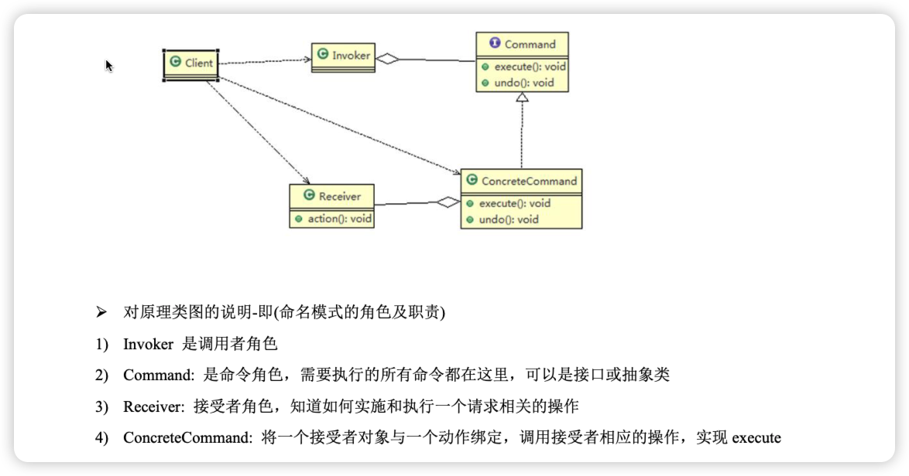

### 1、命令模式
#### 1、模式类型：
    行为型
#### 2、基本介绍：
命令模式（Command Pattern）：
 在软件设计中，我们经常需要向某些对象发送请求，但是并不知道请求的接收
 者是谁，也不知道被请求的操作是哪个，我们只需在程序运行时指定具体的请求接收者即可，此时，可以使用命令模式来进行设计。
1) 命名模式<FONT COLOR=RED>使得请求发送者与请求接收者消除彼此之间的耦合，让对象之间的调用关系更加灵活，实现解耦。</font>
2) 在命名模式中，会将一个请求封装为一个对象，以便使用不同参数来表示不同的请求(即命名)，同时命令模式
也支持可撤销的操作。

#### 3、原理图


### 2、实例代码：

```


```

### 3、注意事项

将发起请求的对象与执行请求的对象解耦。发起请求的对象是调用者，调用者只要调用命令对象的execute()方
法就可以让接收者工作，而不必知道具体的接收者对象是谁、是如何实现的，命令对象会负责让接收者执行请
求的动作，也就是说：”请求发起者”和“请求执行者”之间的解耦是通过命令对象实现的，命令对象起到了
纽带桥梁的作用。
2) 容易设计一个命令队列。只要把命令对象放到列队，就可以多线程的执行命令
3) 容易实现对请求的撤销和重做
4) **命令模式不足：可能导致某些系统有过多的具体命令类，增加了系统的复杂度，这点在在使用的时候要注意**
5) 空命令也是一种设计模式，它为我们省去了判空的操作。在上面的实例中，如果没有用空命令，我们每按下一
个按键都要判空，这给我们编码带来一定的麻烦。

### 4、应用场景
```
界面的一个按钮都是一条命令、
模拟CMD（DOS 命令）订单的撤销/恢复、触发-反馈机制
```


   


### 参考资料
 [设计模式-代理模式](http://www.jasongj.com/design_pattern/proxy_decorator/)</BR>
 [动态dialing-cgib ](http://www.jasongj.com/design_pattern/dynamic_proxy_cglib/)
 [常用结构性模型](https://www.jianshu.com/p/b2c08a670299)

 [设计模式-视频讲解](https://www.bilibili.com/video/BV1G4411c7N4?p=6&vd_source=7c47b6d72612787b009ac686785b509a)

 [设计模式-原则](https://github-yuteng.github.io/2019/08/01/%E8%AE%BE%E8%AE%A1%E6%A8%A1%E5%BC%8F%E4%B8%83%E5%A4%A7%E5%8E%9F%E5%88%99/)
 <!--more-->