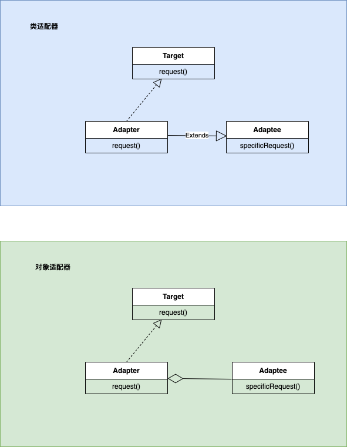

### 1、模式类型：
    结构型
### 2、定义：
 享元模式（Flyweight Pattern） 也叫 蝇量模式: 运用<font color=red>共享</font>技术有效地支持大量细粒度的对象
2) 常用于系统底层开发，解决系统的性能问题。像数据库连接池，里面都是创建好的连接对象，在这些连接对象
中有我们需要的则直接拿来用，避免重新创建，如果没有我们需要的，则创建一个
3) 享元模式能够解决重复对象的内存浪费的问题，当系统中有大量相似对象，需要缓冲池时。不需总是创建新对
象，可以从缓冲池里拿。这样可以降低系统内存，同时提高效率

### 3、原理图
#### 3.1 UML类图


#### 3.2 原理角色说明
对原理图的说明-即(模式的角色及职责)
```
1) FlyWeight 是抽象的享元角色, 他是产品的抽象类, 
同时定义出对象的外部状态和内部状态(后面介绍) 的接口
或实现
1) ConcreteFlyWeight 是具体的享元角色，是具体的产品类，实现抽象角色定义相关业务
2) UnSharedConcreteFlyWeight 是不可共享的角色，一般不会出现在享元工厂。
3) FlyWeightFactory 享元工厂类，用于构建一个池容器(集合)， 同时提供从池中获取对象方法
```

<FONT Color=RED>内部状态和外部状态</FONT>
比如围棋、五子棋、跳棋，它们都有大量的棋子对象，围棋和五子棋只有黑白两色，跳棋颜色多一点，所以棋子颜
色就是棋子的内部状态；而各个棋子之间的差别就是位置的不同，当我们落子后，落子颜色是定的，但位置是变化
的，所以棋子坐标就是棋子的外部状态
1) 享元模式提出了两个要求：细粒度和共享对象。这里就涉及到内部状态和外部状态了，即将对象的信息分为两
个部分：内部状态和外部状态
2) 内部状态指对象共享出来的信息，存储在享元对象内部且不会随环境的改变而改变
3) 外部状态指对象得以依赖的一个标记，是随环境改变而改变的、不可共享的状态


### 3、应用场景

享元模式经典的应用场景就是:
```
池技术了，String 常量池、数据库连接池、缓冲池等等都是享元模式的应用，享元模式是池技术的重要实现方式
```

### 代码实例

```
public interface Car {
    void drive(String location);
}

// 具体享元实现类
public class ConcreteCar implements Car {
    private String brand; // 内部状态

    public ConcreteCar(String brand) {
        this.brand = brand;
    }

    @Override
    public void drive(String location) {
        System.out.println("Driving " + brand + " to " + location);
    }
}

// 享元工厂
public class CarFactory {
    private Map<String, Car> cars = new HashMap<>();

    public Car getCar(String brand) {
        Car car = cars.get(brand);

        if (car == null) {
            // 如果享元池中不存在该品牌的车辆，则创建新的享元对象并放入享元池中
            car = new ConcreteCar(brand);
            cars.put(brand, car);
        }

        return car;
    }
}

// 客户端代码
public class Client {
    public static void main(String[] args) {
        CarFactory carFactory = new CarFactory();

        // 获取享元对象并设置外部状态
        Car car1 = carFactory.getCar("Toyota");
        car1.drive("New York");

        Car car2 = carFactory.getCar("Toyota");
        car2.drive("Los Angeles");

        Car car3 = carFactory.getCar("BMW");
        car3.drive("San Francisco");

        // 对比对象引用，可以看到car1和car2是同一个对象，而car3是另一个对象
        System.out.println("car1 == car2: " + (car1 == car2)); // true
        System.out.println("car1 == car3: " + (car1 == car3)); // false
    }
}

```


   


### 参考资料
 [设计模式资料](http://www.jasongj.com/design_pattern/simple_factory/)</BR>
 [常用结构性模型](https://www.jianshu.com/p/b2c08a670299)

 [设计模式-视频讲解](https://www.bilibili.com/video/BV1G4411c7N4?p=6&vd_source=7c47b6d72612787b009ac686785b509a)

 [设计模式-原则](https://github-yuteng.github.io/2019/08/01/%E8%AE%BE%E8%AE%A1%E6%A8%A1%E5%BC%8F%E4%B8%83%E5%A4%A7%E5%8E%9F%E5%88%99/)
 <!--more-->