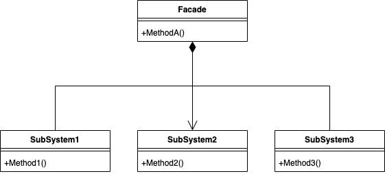

### 1、外观模式也叫门面模式
### 1、模式类型：
    结构型
#### 2、定义：
 1) 外观模式（Facade），也叫“过程模式
   外观模式为子系统中的一组接口提供一个一致的界面，此模式定义了一个高层接口，这个接口使得这一子系统更加
容易使用
1) 外观模式通过定义一个一致的接口，用以屏蔽内部子系统的细节，使得调用端
只需跟这个接口发生调用，而无需关心这个子系统的内部细节

#### 3、原理类图
##### 3.1 uml 图




##### 3.2 原理说明
```
1) 外观类(Facade): 为调用端提供统一的调用接口, 外观类知道哪些子系统负责处理请求,从而将调用端的请求代理给适当
子系统对象
2) 调用者(Client): 外观接口的调用者
3) 子系统的集合：指模块或者子系统，处理Facade 对象指派的任务，他是功能的实际提供者

```
### 2、代码实例：
```
// 子系统接口
public interface SubsystemA {
    void operationA();
}

public interface SubsystemB {
    void operationB();
}

public interface SubsystemC {
    void operationC();
}

// 具体子系统实现
public class ConcreteSubsystemA implements SubsystemA {
    @Override
    public void operationA() {
        System.out.println("SubsystemA operation A");
    }
}

public class ConcreteSubsystemB implements SubsystemB {
    @Override
    public void operationB() {
        System.out.println("SubsystemB operation B");
    }
}

public class ConcreteSubsystemC implements SubsystemC {
    @Override
    public void operationC() {
        System.out.println("SubsystemC operation C");
    }
}

// 外观类
public class Facade {
    private SubsystemA subsystemA;
    private SubsystemB subsystemB;
    private SubsystemC subsystemC;

    public Facade() {
        subsystemA = new ConcreteSubsystemA();
        subsystemB = new ConcreteSubsystemB();
        subsystemC = new ConcreteSubsystemC();
    }

    public void operation() {
        subsystemA.operationA();
        subsystemB.operationB();
        subsystemC.operationC();
    }
}

// 客户端代码
public class Client {
    public static void main(String[] args) {
        Facade facade = new Facade();
        facade.operation();
    }
}
```

### 3、优缺点
```
优点：
1) 外观模式对外屏蔽了子系统的细节，因此外观模式降低了客户端对子系统使用的复
杂性
2) 外观模式对客户端与子系统的耦合关系，让子系统内部的模块更易维护和扩展
3) 通过合理的使用外观模式，可以帮我们更好的划分访问的层次
4) 当系统需要进行分层设计时，可以考虑使用Facade模式
5) 在维护一个遗留的大型系统时，可能这个系统已经变得非常难以维护和扩展，此时
可以考虑为新系统开发一个Facade类，来提供遗留系统的比较清晰简单的接口，
让新系统与Facade类交互，提高复用性
6) 不能过多的或者不合理的使用外观模式，使用外观模式好，还是直接调用模块好。
要以让系统有层次，利于维护为目的。

```


   


### 参考资料
 [设计模式资料](http://www.jasongj.com/design_pattern/simple_factory/)</BR>
 [常用结构性模型](https://www.jianshu.com/p/b2c08a670299)

 [设计模式-视频讲解](https://www.bilibili.com/video/BV1G4411c7N4?p=6&vd_source=7c47b6d72612787b009ac686785b509a)

 [设计模式-原则](https://github-yuteng.github.io/2019/08/01/%E8%AE%BE%E8%AE%A1%E6%A8%A1%E5%BC%8F%E4%B8%83%E5%A4%A7%E5%8E%9F%E5%88%99/)
 <!--more-->