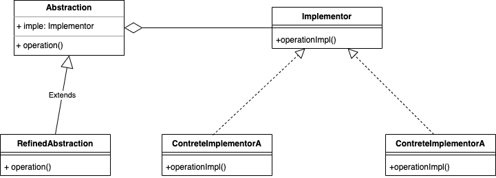

### 1 桥接模式
#### 1 定义：
桥接模式（Bridge Pattern）

<FONT COLOR=RED>将抽象部分与它的实现分离，使它们都可以独立地变化。</FONT>
桥接模式的核心思想是:将抽象部分与实现部分分离，通过桥接接口来连接它们。
抽象部分包含高层的业务逻辑，而实现部分包含底层的具体实现。通过桥接模式，可以在两个维度上进行独立地变化，而不会相互影响。

#### 2、原理类图
##### 2.1 uml 图



##### 2.2 原理说明
```
Abstraction（抽象部分）：定义高层的业务逻辑，并包含对实现部分的引用。抽象部分可以是一个抽象类或接口。
RefinedAbstraction（具体抽象类）：继承抽象部分，并扩展其功能。
Implementor（实现部分）：定义实现部分的接口，提供具体实现的方法。
ConcreteImplementor（具体实现类）：实现实现部分接口的具体实现。
```

#### 代码示意
```
// 实现部分的接口
public interface Implementor {
    void operationImpl();
}

// 具体实现类
public class ConcreteImplementorA implements Implementor {
    @Override
    public void operationImpl() {
        System.out.println("ConcreteImplementorA operation");
    }
}

public class ConcreteImplementorB implements Implementor {
    @Override
    public void operationImpl() {
        System.out.println("ConcreteImplementorB operation");
    }
}

// 抽象部分的接口
public abstract class Abstraction {
    protected Implementor implementor;

    public Abstraction(Implementor implementor) {
        this.implementor = implementor;
    }

    public abstract void operation();
}

// 具体抽象类
public class RefinedAbstraction extends Abstraction {
    public RefinedAbstraction(Implementor implementor) {
        super(implementor);
    }

    @Override
    public void operation() {
        System.out.println("RefinedAbstraction operation");
        implementor.operationImpl();
    }
}

// 客户端代码
public class Client {
    public static void main(String[] args) {
        Implementor implementorA = new ConcreteImplementorA();
        Implementor implementorB = new ConcreteImplementorB();

        Abstraction abstractionA = new RefinedAbstraction(implementorA);
        abstractionA.operation();

        Abstraction abstractionB = new RefinedAbstraction(implementorB);
        abstractionB.operation();
    }
}


```


### 3 桥接模式的优缺点

#### 3.1 桥接模式的优点

```
分离抽象和实现部分，使它们可以独立地变化。
扩展性好，可以通过增加新的抽象和实现类来扩展系统功能。
提高了系统的灵活性和可维护性。
```
#### 3.2 桥接模式的缺点包括：

```
增加了系统的复杂性，由于需要定义抽象和实现部分以及它们之间的桥接接口。
对于简单的系统，引入桥接模式可能会显得过于繁琐。
适用场景：
当系统有多个维度变化且维度之间存在关联关系时，可以考虑使用桥接模式。
当希望抽象部分和实现部分可以独立地变化，且可以动态地组合时，可以使用桥接

```
### 参考资料
 [设计模式资料](http://www.jasongj.com/design_pattern/simple_factory/)</BR>
 [常用结构性模型](https://www.jianshu.com/p/b2c08a670299)
[设计模式-桥接模式](https://www.runoob.com/design-pattern/bridge-pattern.html)
 [设计模式-视频讲解](https://www.bilibili.com/video/BV1G4411c7N4?p=6&vd_source=7c47b6d72612787b009ac686785b509a)

 
 <!--more-->