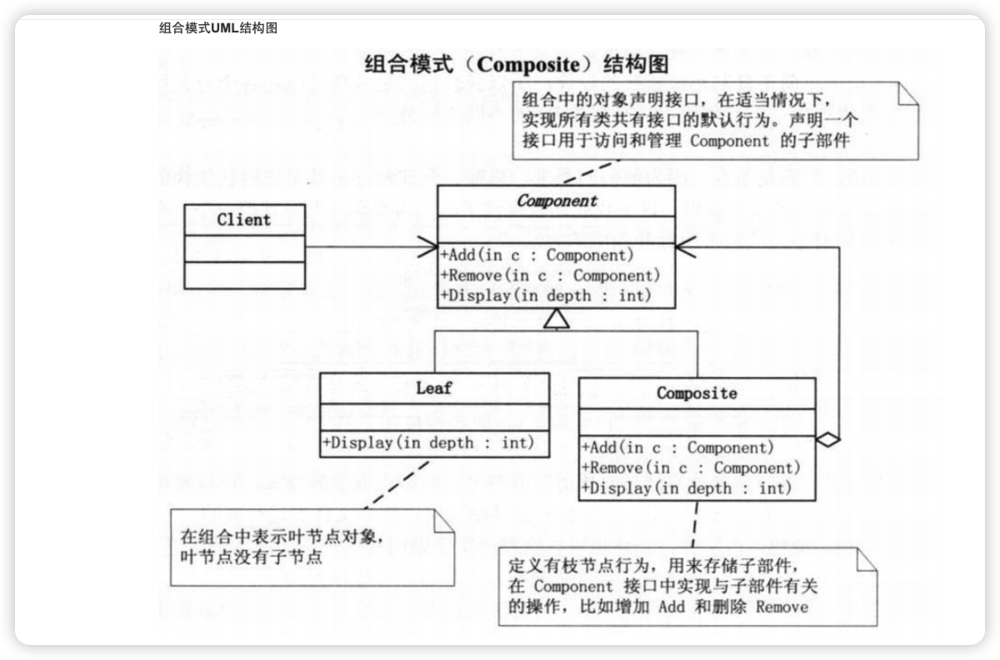

### 1、组合模式
1、模式类型： 结构型

又叫部分整体模式，是用于把一组相似的对象当作一个单一的对象。组合模式依据树形结构来组合对象，用来表示部分以及整体层次。这种类型的设计模式属于结构型模式，它创建了对象组的树形结构。

意图：**将对象组合成树形结构**以表示"部分-整体"的层次结构。组合模式使得用户对单个对象和组合对象的使用具有一致性。

主要解决：它在我们树型结构的问题中，模糊了简单元素和复杂元素的概念，客户程序可以像处理简单元素一样来处理复杂元素，从而使得客户程序与复杂元素的内部结构解耦。
组合模式依据树形结构来组合对象，用来表示部分以及整体层次。
### 2、原理图

#### 2.1 UML



#### 2.1 原理说明

组合模式的相关角色：
```
组件（Component）：定义了组合对象和叶子对象的共同接口，可以是抽象类或接口。
树枝节点（Composite）：表示组合对象，可以包含子节点，实现了组件接口。
叶子节点（Leaf）：表示叶子对象，不包含子节点，实现了组件接口。

```

### 3、实例：
```
// 组件接口
interface Component {
    void showName();
}

// 树枝节点
class Composite implements Component {
    private String name;
    private List<Component> children = new ArrayList<>();

    public Composite(String name) {
        this.name = name;
    }

    public void add(Component component) {
        children.add(component);
    }

    public void remove(Component component) {
        children.remove(component);
    }

    public List<Component> getChildren() {
        return children;
    }

    @Override
    public void showName() {
        System.out.println("Composite: " + name);
        for (Component component : children) {
            component.showName();
        }
    }
}

// 叶子节点
class Leaf implements Component {
    private String name;

    public Leaf(String name) {
        this.name = name;
    }

    @Override
    public void showName() {
        System.out.println("Leaf: " + name);
    }
}

// 客户端代码
public class Client {
    public static void main(String[] args) {
        Composite company = new Composite("Company");

        Composite department1 = new Composite("Department 1");
        department1.add(new Leaf("Employee 1"));
        department1.add(new Leaf("Employee 2"));

        Composite department2 = new Composite("Department 2");
        department2.add(new Leaf("Employee 3"));
        department2.add(new Leaf("Employee 4"));

        company.add(department1);
        company.add(department2);

        company.showName();
    }
}

```
### 4、优缺点
```
优点： 1、高层模块调用简单。 2、节点自由增加。

缺点：在使用组合模式时，其叶子和树枝的声明都是实现类，而不是接口，违反了依赖倒置原则。

使用场景：部分、整体场景，如树形菜单，文件、文件夹的管理。
```


### 参考资料
 [设计模式资料](http://www.jasongj.com/design_pattern/simple_factory/)</BR>
 [常用结构性模型](https://www.jianshu.com/p/b2c08a670299)

 [设计模式-视频讲解](https://www.bilibili.com/video/BV1G4411c7N4?p=6&vd_source=7c47b6d72612787b009ac686785b509a)

 [设计模式-组合模式](https://www.runoob.com/design-pattern/composite-pattern.html)
 <!--more--> 